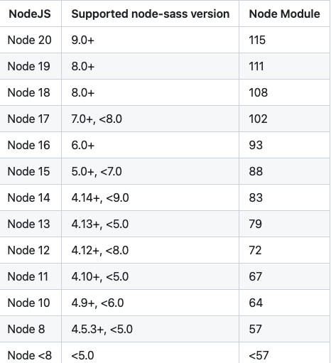

# vue2.0-framework

#### 介绍
借鉴优秀的开源代码整合适合自己的vue2.0框架

#### 软件架构
软件架构说明

#### 目录解析
vue2.0-framework           # 项目目录
    ├── node_modules       # 项目依赖的第三方包
    ├── public             # 静态文件目录
      ├── favicon.ico      # 浏览器小图标
      └── index.html       # 单页面的html文件(网页浏览的是它)
    ├── src                # 业务文件夹
      ├── assets           # 静态资源
        └── logo.png       # vue的logo图片
      ├── components       # 组件目录
        └── HelloWorld.vue # 欢迎页面vue代码文件
      ├── App.vue          # 整个应用的根组件
      └── main.js          # 入口js文件
    ├── .gitignore         # git提交忽略配置
    ├── babel.config.js    # babel配置
    ├── package.json       # 依赖包列表
    ├── README.md          # 项目说明
	└── yarn.lock          # 项目包版本锁定和缓存地址

node_modules下都是下载的第三方包
public/index.html – 浏览器运行的网页
src/main.js – webpack打包的入口文件
src/App.vue – vue项目入口页面
package.json – 依赖包列表文件

#### 安装教程

1.  xxxx
2.  xxxx
3.  xxxx

#### 使用说明

1.  xxxx
2.  xxxx
3.  xxxx

#### 参与贡献

1.  Fork 本仓库
2.  新建 Feat_xxx 分支
3.  提交代码
4.  新建 Pull Request


#### 特技

1.  使用 Readme\_XXX.md 来支持不同的语言，例如 Readme\_en.md, Readme\_zh.md
2.  Gitee 官方博客 [blog.gitee.com](https://blog.gitee.com)
3.  你可以 [https://gitee.com/explore](https://gitee.com/explore) 这个地址来了解 Gitee 上的优秀开源项目
4.  [GVP](https://gitee.com/gvp) 全称是 Gitee 最有价值开源项目，是综合评定出的优秀开源项目
5.  Gitee 官方提供的使用手册 [https://gitee.com/help](https://gitee.com/help)
6.  Gitee 封面人物是一档用来展示 Gitee 会员风采的栏目 [https://gitee.com/gitee-stars/](https://gitee.com/gitee-stars/)


# build for production with minification
npm run build

# build for production and view the bundle analyzer report
npm run build --report
```

## Description
> For a detailed explanation on how things work, check out the
> [guide](http://vuejs-templates.github.io/webpack/)
> and [docs for vue-loader](http://vuejs.github.io/vue-loader).

## Node.js support
>


# vue2.0-framework

> A Vue.js project

## Build Setup

``` bash
# install dependencies
npm install

# serve with hot reload at localhost:8080
npm run dev

# build for production with minification
npm run build

# build for production and view the bundle analyzer report
npm run build --report

# run unit tests
npm run unit

# run e2e tests
npm run e2e

# run all tests
npm test
```
## Description
For a detailed explanation on how things work, check out the [guide](http://vuejs-templates.github.io/webpack/) and [docs for vue-loader](http://vuejs.github.io/vue-loader).


## Node.js support
>

#### 疑难问题解决

如果安装node-sass的时候报错python找不到，可能是node-sass版本和node版本对不上，可以参考下面的图指定对应的版本安装



现在更流行的做法是，用dart-sass代替node-sass，dart-sass使用纯js编写，无需下载二进制文件。

